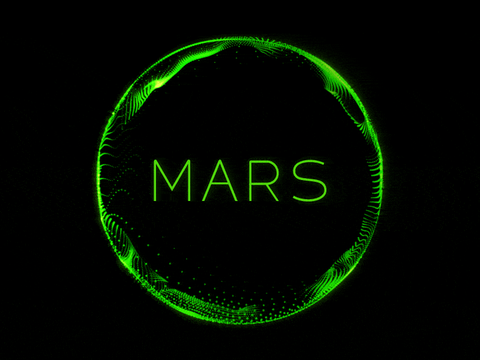

 
MARS
Multifunctional AI Responsive System

MARS is an innovative AI project developed by researchers at EMA EMITS College Philippines. It harnesses the power of the Flask Python framework and the state-of-the-art GPT-3.5-turbo language model. The primary objective of MARS is to seamlessly integrate Text-to-Speech (TTS), Speech-to-Text (STT), and the world's most advanced Language Model (LLM), thereby providing a highly functional and intelligent voice AI assistant.

MARS is currently in its developmental phase, with continuous efforts being made to enhance its capabilities and performance. The researchers are actively working on improving the integration of various components, refining the user experience, and expanding the functionality of the system.

\[!IMPORTANT]

This currently represents a Prototype Web Application. While it showcases the core features and potential of MARS, it is still an ongoing project, and further improvements and updates are expected in the future.

---

Copyright © 2023 MARS.  
This project is [MIT](./LICENSE) licensed.

