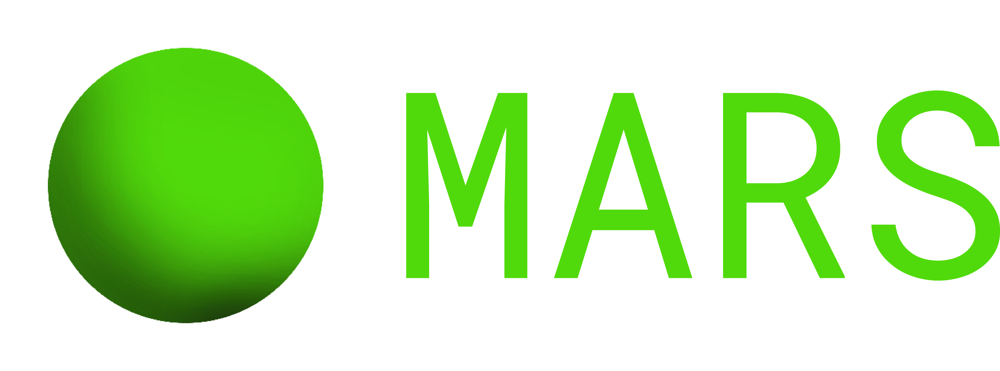

# Multifunctional AI Responsive System

MARS utilizes the state-of-the-art capabilities of GPT-4-turbo, an advanced language model developed by OpenAI. Its mission is to seamlessly integrate Text-to-Speech (TTS), Speech-to-Text (STT) to provide an exceptional voice AI assistant experience. Leveraging cutting-edge AI technologies, MARS can deliver natural and intelligent interactions like a real person.

---

**Note: MARS is currently in its developmental phase, with ongoing efforts dedicated to its refinement and enhancement.** <a href="image/conceptual-model.svg">View Diagram</a>

## Features

- **Text-to-Speech (TTS)**: Converts written text into natural-sounding speech.
- **Speech-to-Text (STT)**: Transforms spoken language into text with high accuracy.
- **Large Language Model (LLM)**: Utilizes GPT-4-turbo for sophisticated language understanding and generation.

---

MARS is licensed under the terms of the <a href="./LICENSE">MIT License</a>.

---

© 2024 MARS. All rights reserved.

