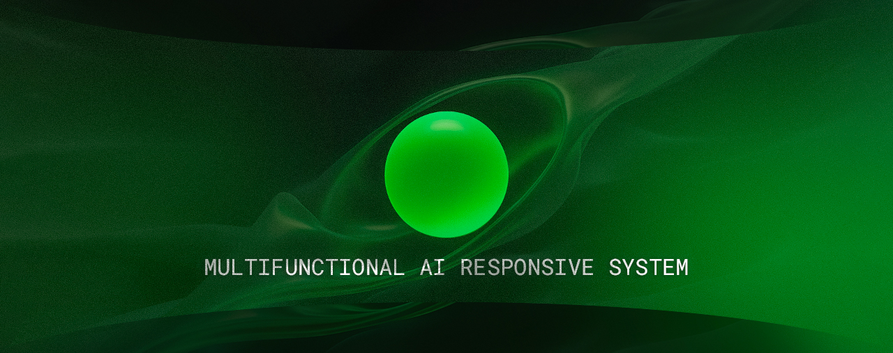

<h1 align="center">○</h1>

    <strong>The future is here.</strong> 

    <strong>MARS</strong> leverages state-of-the-art Language Models to seamlessly integrate Large Language Model <strong>(LLM)</strong>, Text-to-Speech <strong>(TTS)</strong>, and Speech-to-Text <strong>(STT)</strong> technologies. This powerful combination provides an exceptional voice AI assistant experience with rapid inference speeds. By utilizing these cutting-edge AI technologies, MARS delivers natural and intelligent interactions, mimicking human conversation.

---

    <strong>Note:</strong> MARS is currently in its <strong>developmental</strong> phase, with ongoing efforts dedicated to its refinement and enhancement. 
     <a href="static/conceptual-model.svg">View Diagram</a>

## Features

- **Text-to-Speech (TTS)**: Converts written text into natural-sounding speech.
- **Speech-to-Text (STT)**: Accurately transforms spoken language into text.
- **Large Language Model (LLM)**: Provides sophisticated language understanding and generation capabilities.

---

MARS is licensed under the terms of the <a href="./LICENSE">MIT License</a>.

---

© 2024 MARS. All rights reserved.

